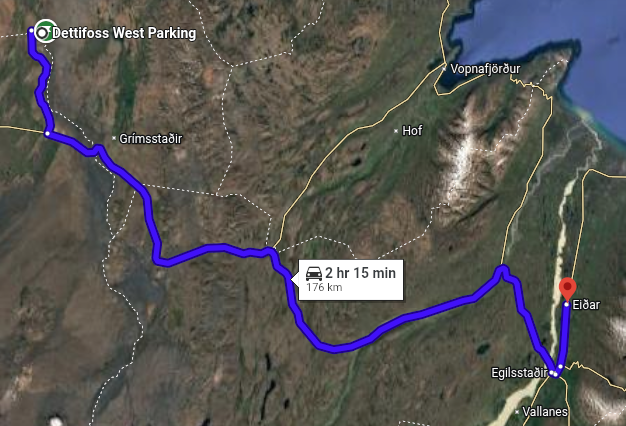
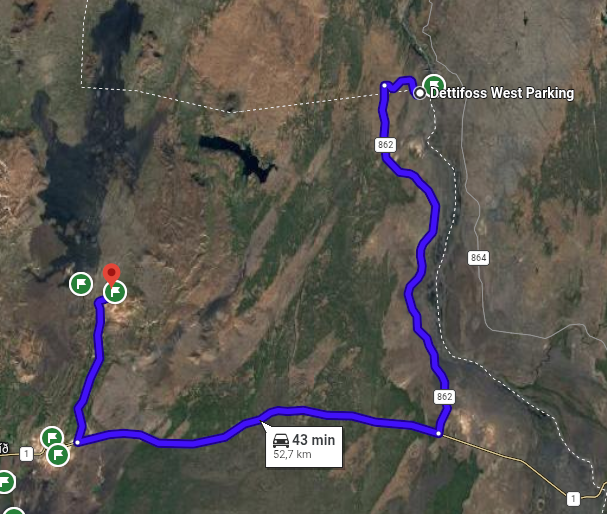
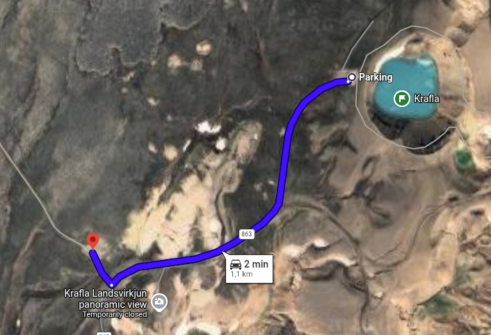
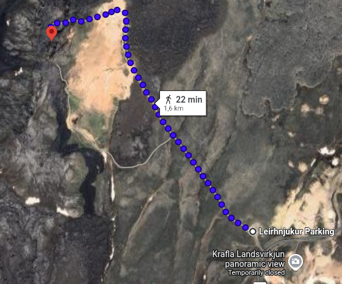
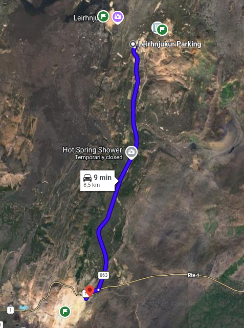
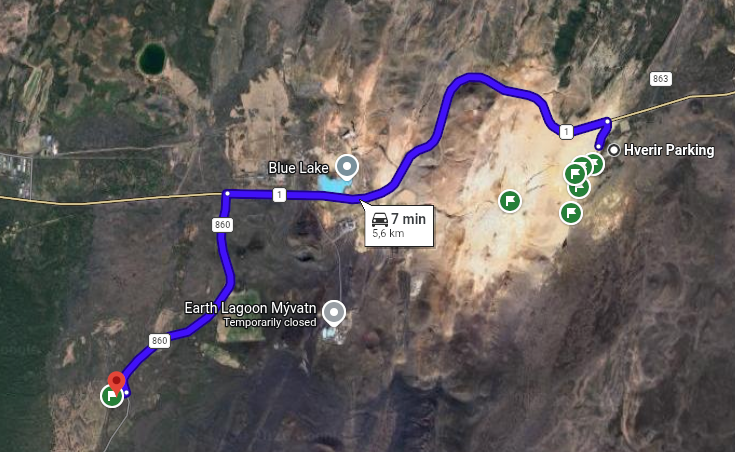
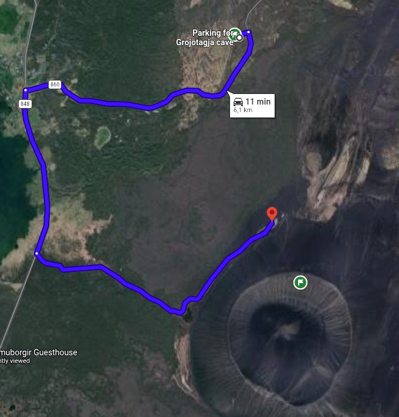
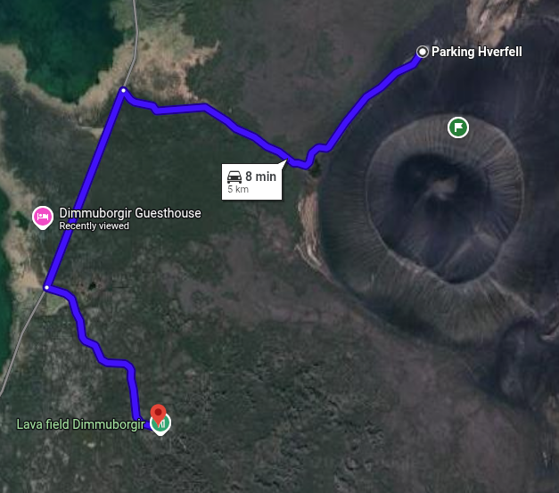
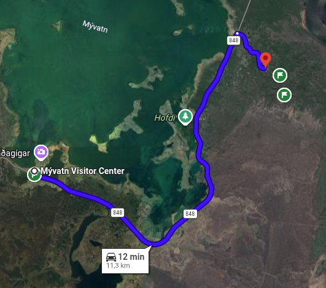
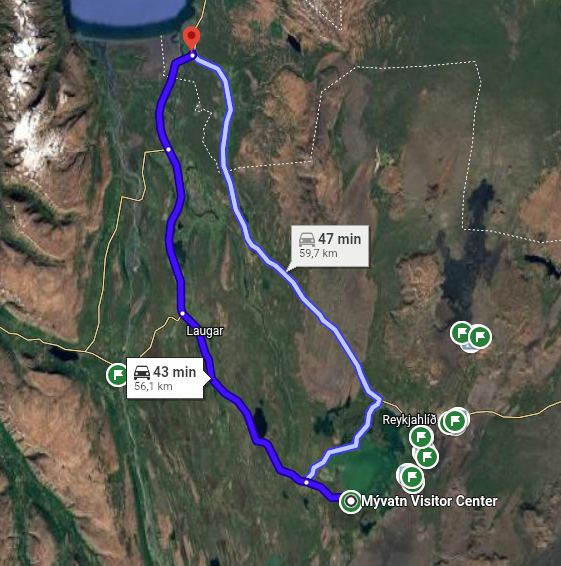

[← Назад](../index.md)

## 01.09.2026 | Myvatn Area

#### From Eiðar to Dettifoss (02:15)

* _**Dettifoss**_

#### From Dettifoss to Krafla (00:43)

* _**Krafla**_

#### From Krafla to Leirhnjukur (00:02)

* _**Leirhnjukur**_

#### From Leirhnjukur to Námafjall (00:09)

* _**Hverir**_

#### From Hverir to Grjótagjá (00:07)

* _**Grjótagjá**_

#### From Grjótagjá to Hverfjall (00:11)

* _**Hverfjall**_

#### From Grjótagjá to Dimmuborgir (00:08)

* _**Kirkjuhringur trail**_
* _**Lava field of Dimmuborgir**_
* _**Kirkja – lava cave**_

#### From Dimmuborgir to Skútustaðir (00:12)

* _**Lake Myvatn (the mosquito lake)**_

#### From Lake Myvatn to Laxhús (00:43)

* _**Sleepover**_
