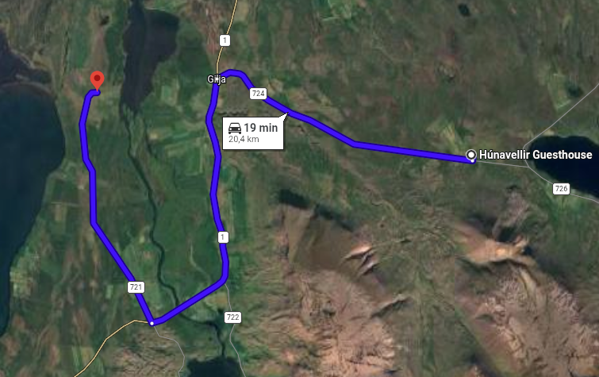
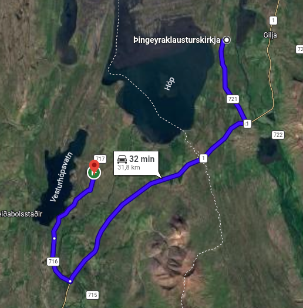
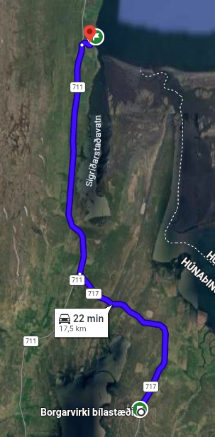
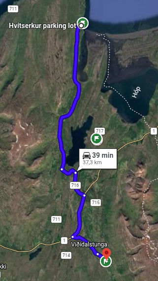
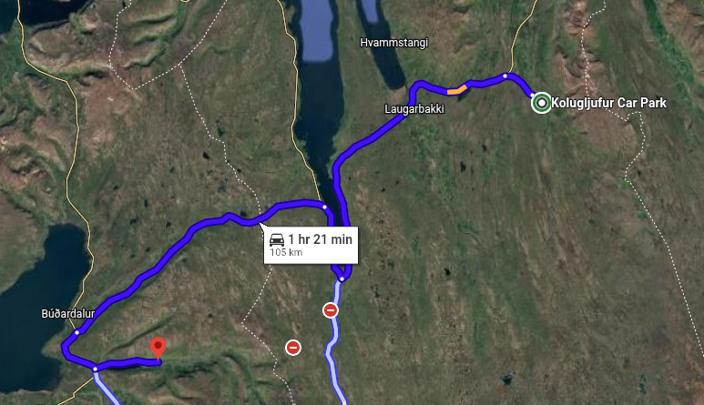
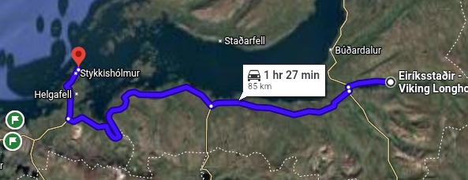
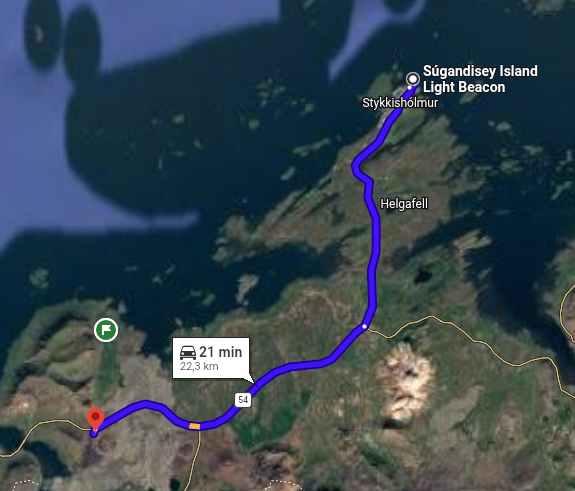
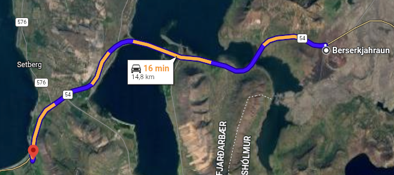

[← Назад](../index.md)

## 04.09.2026 | North Coast to Snaefellsnes

#### From Húnavellir Guesthouse to Þingeyraklausturskirkja Church (00:19)

* _**Þingeyraklausturskirkja Church**_

#### From Þingeyraklausturskirkja Church to Borgarvirki (00:32)

* _**Borgarvirki**_

#### From Borgarvirki to Hvitserkur (00:22)

* _**Hvitserkur**_

#### From Hvitserkur to Kolugljúfur Canyon (00:39)

* _**Kolugljúfur Canyon**_

#### From Kolugljúfur Canyon to Eiriksstadir – Viking Longhouse (01:21)

* _**Eiriksstadir – Viking Longhouse (90 zl)**_

#### From Viking Longhouse to Súgandisey Island Lighthouse (01:27)

* _**Súgandisey Island Lighthouse**_

#### From Súgandisey Island Lighthouse to Berserkjahraun lava field (00:21)

* _**Berserkjahraun lava field**_

#### From Berserkjahraun lava field to Kirkjufell Guesthouse (00:16)

* _**Sleepover**_
