[← Назад](../index.md)

## 05.09.2026 | Snaefellsnes Peninsula

#### From Kirkjufell Guesthouse to Kirkjufell (00:10)
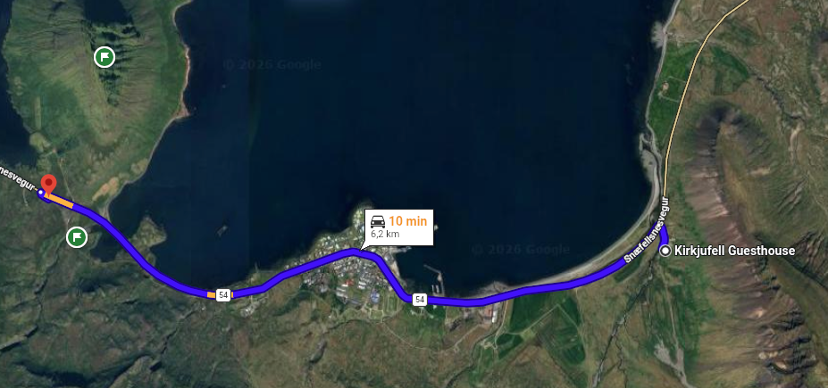
* _**Kirkjufell**_
* _**Kirkjufellsfoss**_

#### From Kirkjufell to Skarðsvík Beach (00:37)
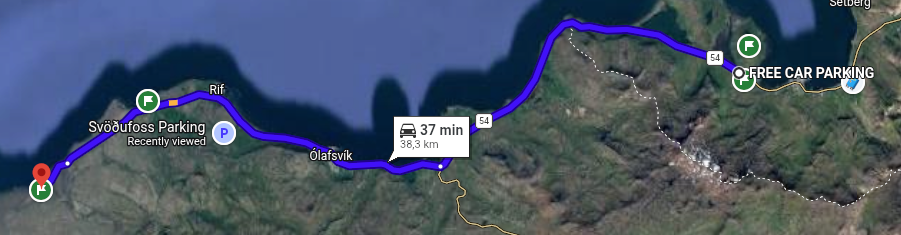
* _**Öndverðarnes Lighthouse**_
* _**Svörtuloft Lighthouse**_

#### From Skarðsvík Beach to Saxholar Volcano Crater (00:09)
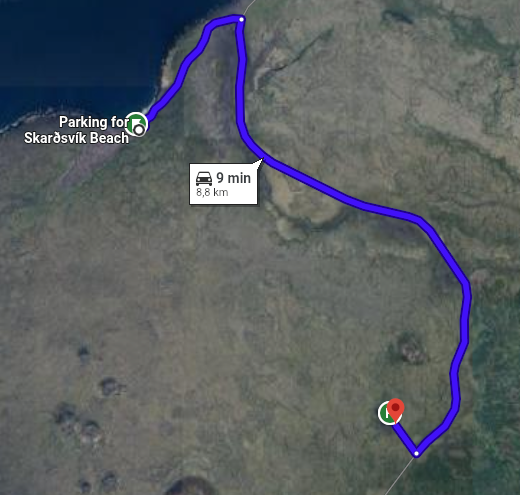
* _**Saxholar Volcano Crater**_

#### From Saxholar Volcano Crater to Djúpalónssandur Beach (00:13)
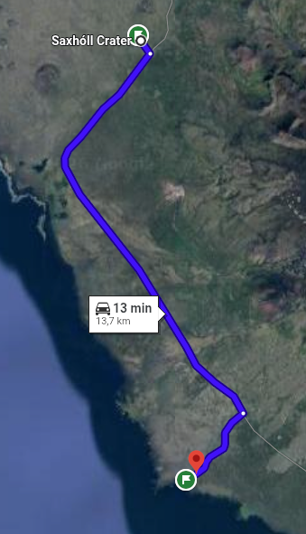
* _**Djúpalónssandur Beach**_

#### From Djúpalónssandur Beach to Vatnshellir Lava Cave (00:07)
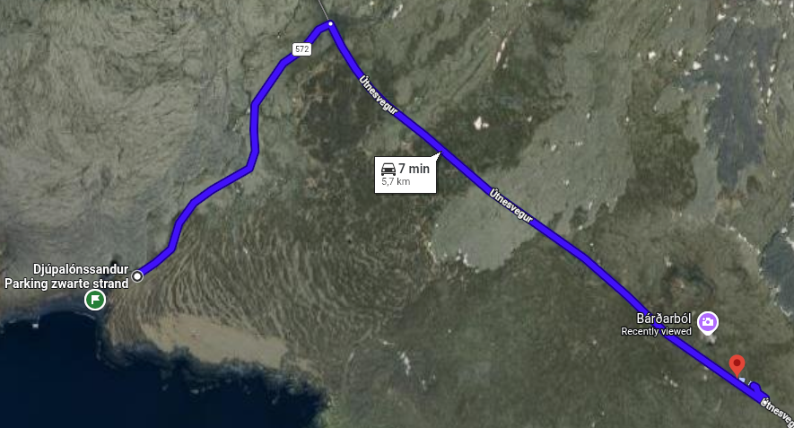
* _**Vatnshellir Lava Cave Tour (170 zl)**_

#### From Vatnshellir Lava Cave to Malariff Lighthouse (00:04)
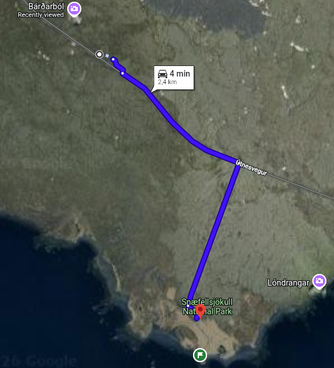
* _**Malariff Lighthouse**_

#### From Malariff Lighthouse to Londrangar View Point (00:04)
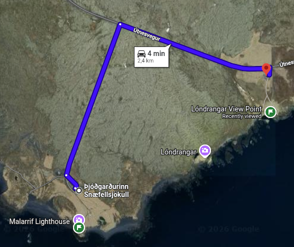
* _**Londrangar View Point**_

#### From Londrangar View Point to Arnarstapi (00:09)
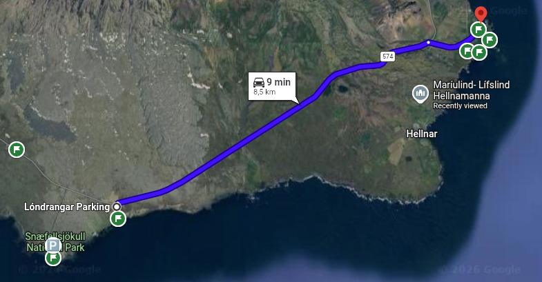
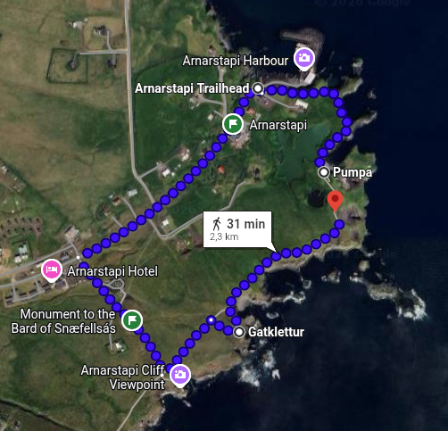
* _**Hiking (1:00)**_

#### From Arnarstapi to Rauðfeldsgjá Gorge (00:07)
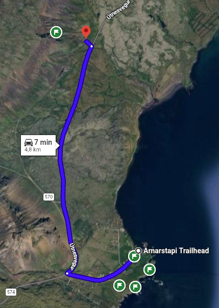
* _**Rauðfeldsgjá Gorge**_

#### From Rauðfeldsgjá Gorge to Búðakirkja (00:14)
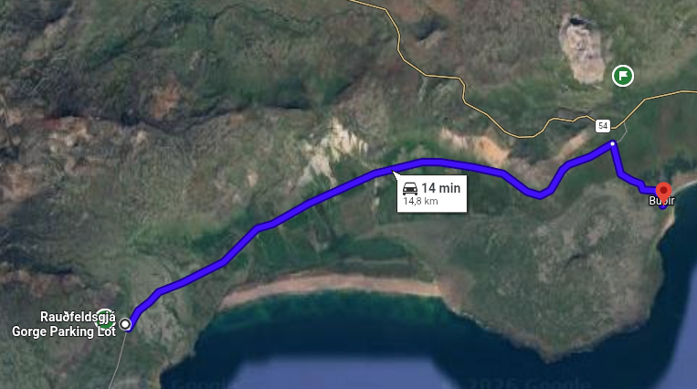
* _**Búðakirkja**_

#### From Búðakirkja to Bjarnarfoss (00:06)
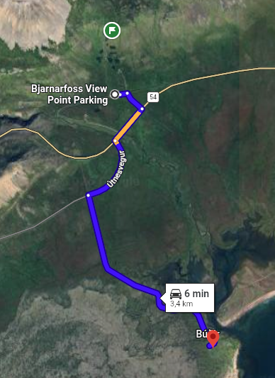
* _**Bjarnarfoss**_

#### From Bjarnarfoss to Ytri Tunga beach (00:18)
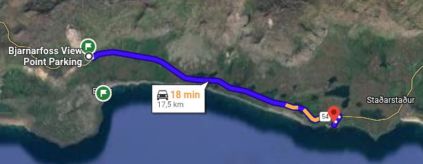
* _**Ytri Tunga beach (seals)**_

#### From Ytri Tunga beach to Gerðuberg Cliffs (00:34)
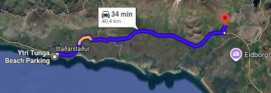
* _**Gerðuberg Cliffs**_

#### From Gerðuberg Cliffs to Borgarnes (00:40)
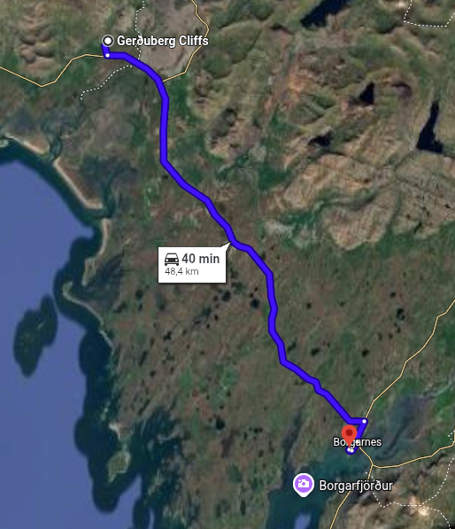
* _**Oversleep**_
