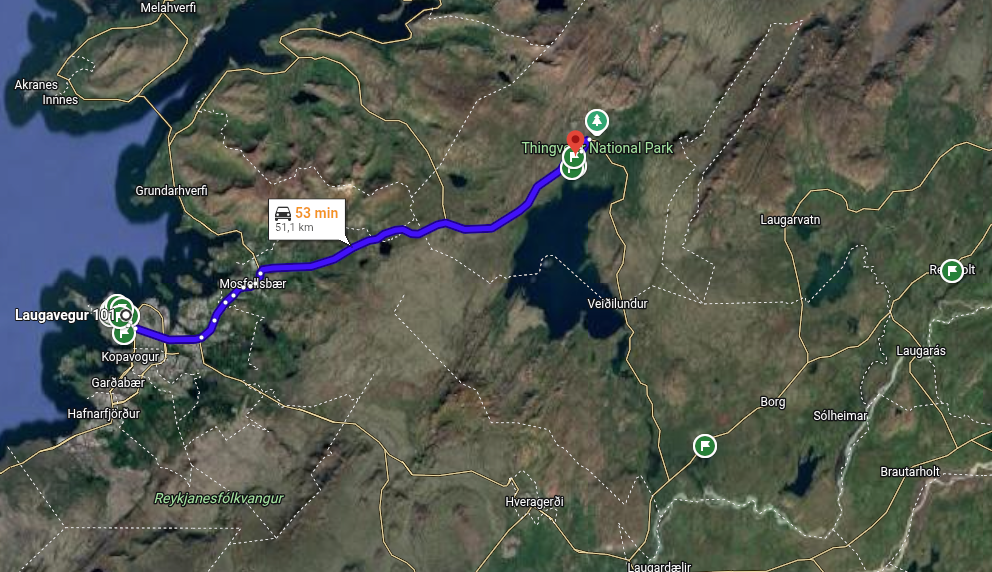
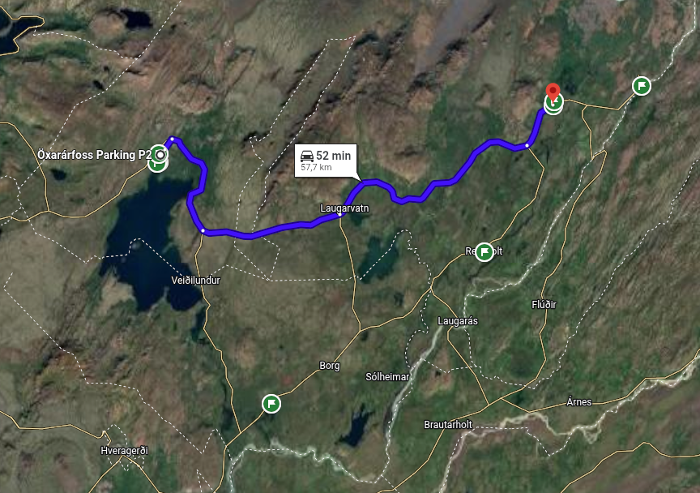
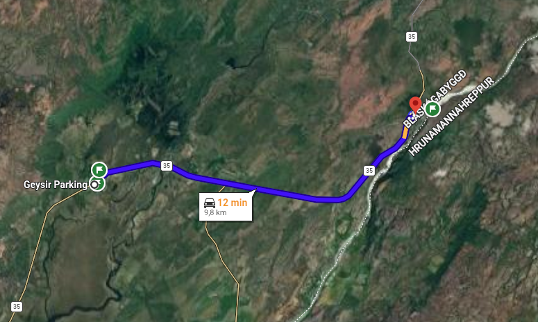
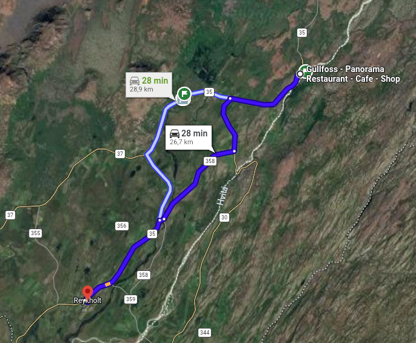
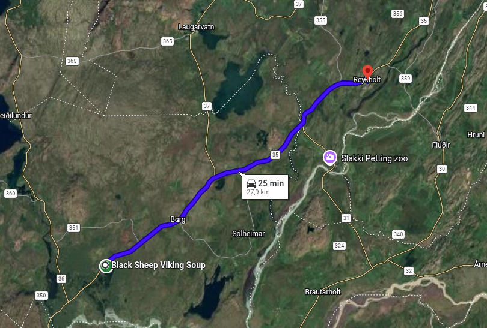
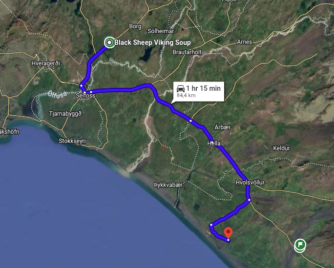

[← Назад](../index.md)

## 29.08.2026 | Golden Circle

#### From Reykjavik to Thingvellir National Park (00:53)

* _**Öxarárfoss Waterfall**_
* _**Nikulasargja Gorge**_
* _**Thingvellir church**_

#### From Thingvellir National Park to Geysir Geothermal Area (00:52)

* _**Strokkur Geyser**_
* _**Geysir Center**_

#### From Geysir Geothermal Area to Gullfoss (00:12)

* _**Gullfoss Falls**_

#### From Gullfoss to Fridheimar Tomato Farm and Restaurant (00:28)

* _**Friðheimar (60 - 120 zl)**_

#### From Friðheimar to Kerid Crater (00:25)

* _**Kerid Crater**_

#### From Kerid Crater to Hamar (01:15)

* _**Sleepover**_
