## 27.08.2026 Keflavic (23:10 landing)

#### From Keflavic to Reykjavik (00:45)
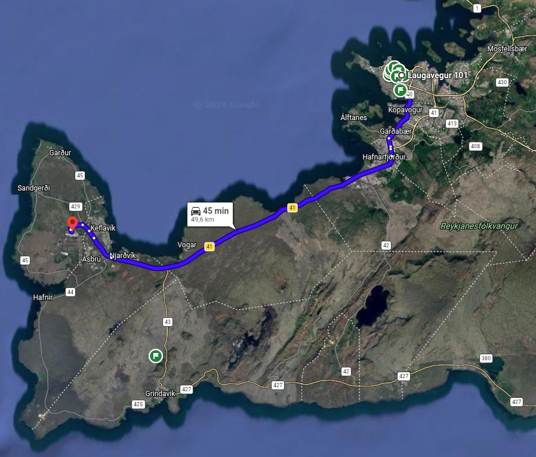

## 28.08.2026 | Reykjavik

#### Perlan (205 zl)
#### Magic Ice Bar Reykjavik (115 zl)
#### Hallgrimskirkja
#### Sun Voyager
#### Harpa Concert Hall
#### Skólavörðustígur, aka Rainbow Street in the center of Reykjavik
#### Laugavegur
#### Tjörnin
#### Monument to the Unknown Bureaucrat
#### Althingi Parliament House
#### Dómkirkjan
#### Landakotskirkja

## 29.08.2026 | Golden Circle

#### From Reykjavik to Thingvellir National Park (00:53)

* _**Öxarárfoss Waterfall**_
* _**Nikulasargja Gorge**_
* _**Thingvellir church**_

#### From Thingvellir National Park to Geysir Geothermal Area (00:52)

* _**Strokkur Geyser**_
* _**Geysir Center**_

#### From Geysir Geothermal Area to Gullfoss (00:12)

* _**Gullfoss Falls**_

#### From Gullfoss to Fridheimar Tomato Farm and Restaurant (00:28)

* _**Friðheimar (60 - 120 zl)**_

#### From Friðheimar to Kerid Crater (00:25)

* _**Kerid Crater**_

#### From Kerid Crater to Hamar (01:15)

* _**Sleepover**_

## 30.08.2026 | South Coast

#### From Hamar to Seljalandsfoss (00:24)
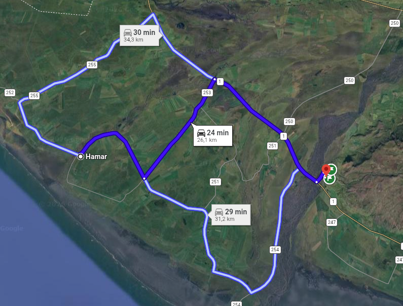
* _**Seljalandsfoss Waterfall**_
* _**Gljúfrabúi waterfall**_

#### From Seljalandsfoss to Skogafoss (00:27)
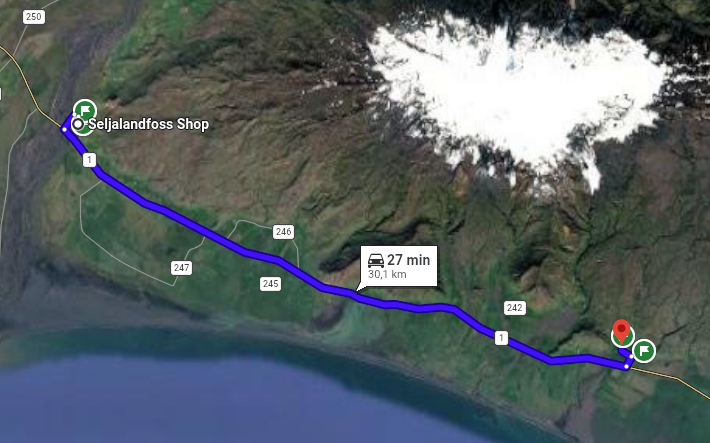
* _**Skogafoss Waterfall**_
* _**Skógar Museum (82 zl)**_

#### From Skogafoss to Dyrhólaey (00:25)
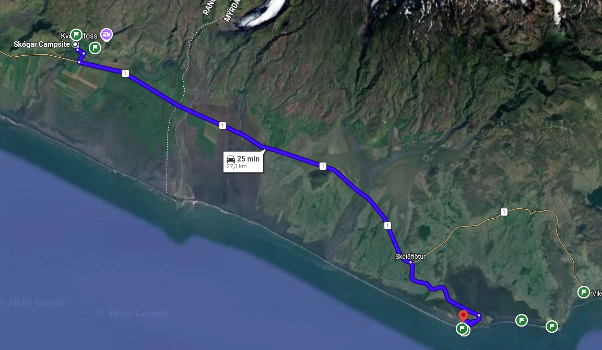
* _**Dyrhólaey Lighthouse**_
* _**Dyrhólaey Viewpoint**_

#### From Dyrhólaey to Reynisfjara (00:04)
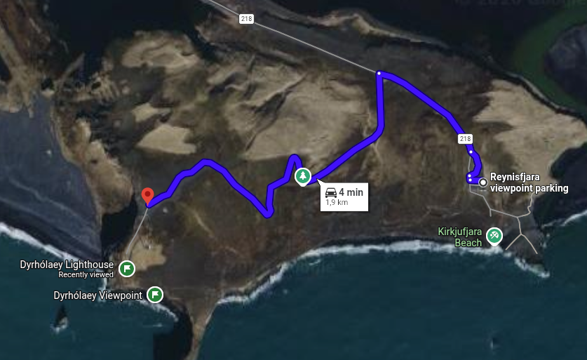
* _**Reynisfjara viewpoint**_

#### From Reynisfjara to Hálsanefshellir Cave (00:21)
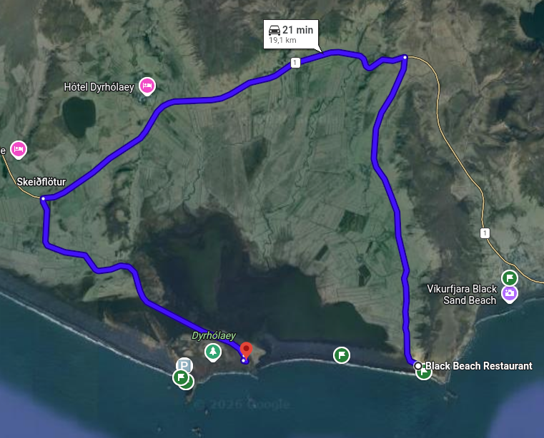
* _**Reynisfjara Beach**_
* _**Hálsanefshellir Cave**_

#### From Hálsanefshellir Cave to Eldhraun lava field (00:57)
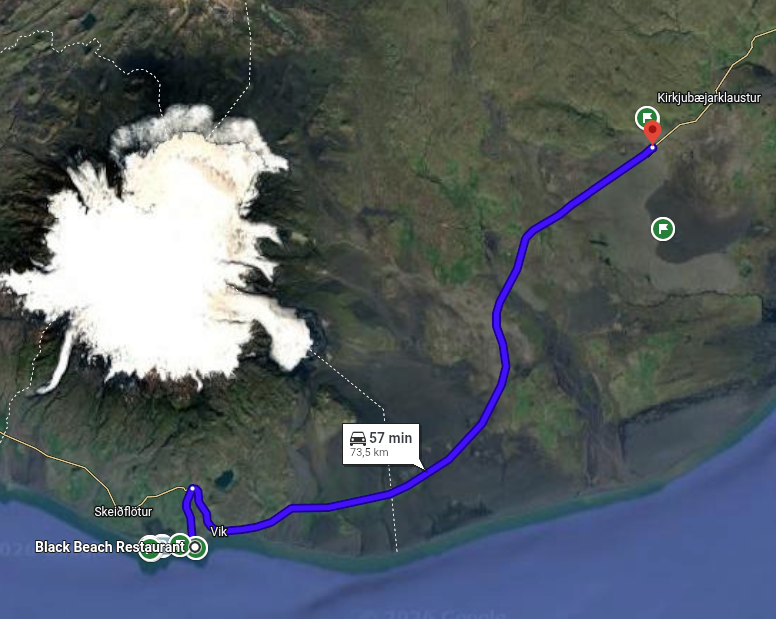
* _**Gönguleið um Eldhraun**_

#### From Eldhraun lava field to Fjaðrárgljúfur (00:08)
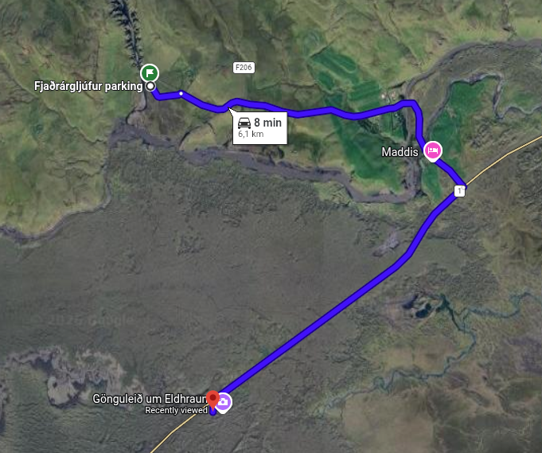
* _**Fjaðrárgljúfur Viewpoint**_

#### From Fjaðrárgljúfur to Svartifoss Trail (00:59)
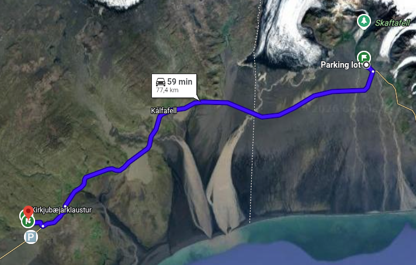
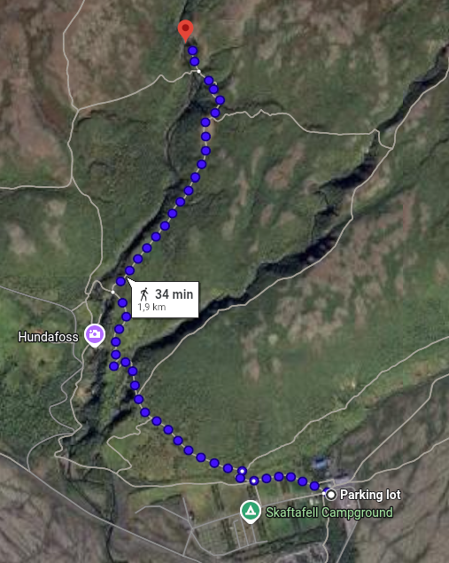
* _**Svartifoss Black Waterfall (about 3 km hiking 1.5 hours in total)**_

#### From Svartifoss to Hofskirkja turf church (00:18)
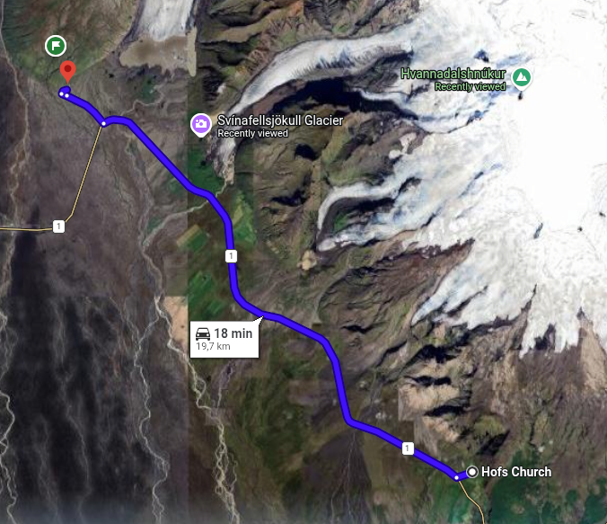
* _**Hofskirkja turf church**_

#### From Hofskirkja turf church to Diamond Beach (00:35)
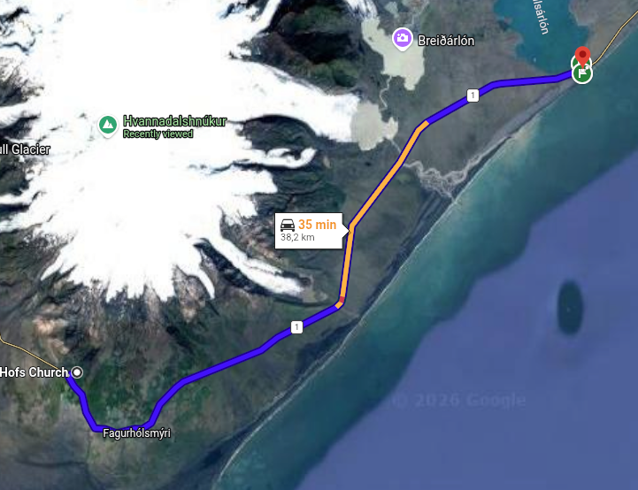
* _**Diamond Beach**_
* _**Jokulsarlon Glacier Lagoon**_

#### From Diamond Beach to Höfn (01:05)
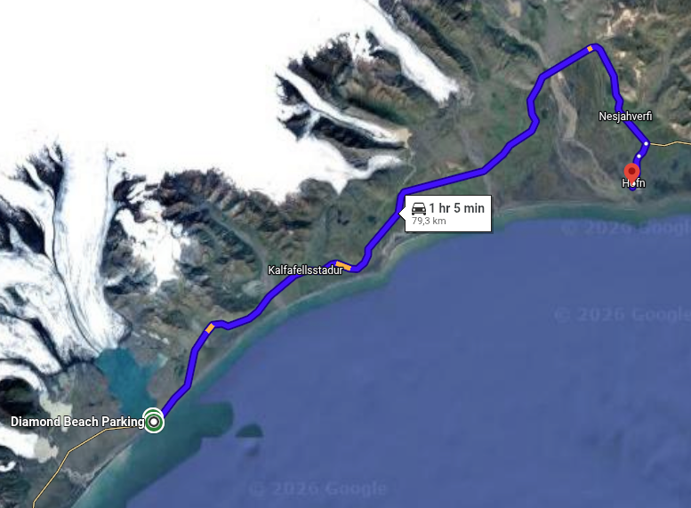
* _**Sleepover**_