## 27.08.2026 Keflavic (23:10 landing)

#### From Keflavic to Reykjavik (00:45)

## 28.08.2026 | Reykjavik

#### Perlan (205 zl)
#### Magic Ice Bar Reykjavik (115 zl)
#### Hallgrimskirkja
#### Sun Voyager
#### Harpa Concert Hall
#### Skólavörðustígur, aka Rainbow Street in the center of Reykjavik
#### Laugavegur
#### Tjörnin
#### Monument to the Unknown Bureaucrat
#### Althingi Parliament House
#### Dómkirkjan
#### Landakotskirkja

## 29.08.2026 | Golden Circle

#### From Reykjavik to Thingvellir National Park (00:53)

* _**Öxarárfoss Waterfall**_
* _**Nikulasargja Gorge**_
* _**Thingvellir church**_

#### From Thingvellir National Park to Geysir Geothermal Area (00:52)

* _**Strokkur Geyser**_
* _**Geysir Center**_

#### From Geysir Geothermal Area to Gullfoss (00:12)

* _**Gullfoss Falls**_

#### From Gullfoss to Fridheimar Tomato Farm and Restaurant (00:28)

* _**Friðheimar (60 - 120 zl)**_

#### From Friðheimar to Kerid Crater (00:25)

* _**Kerid Crater**_

#### From Kerid Crater to Hamar (01:15)

* _**Sleepover**_

## 30.08.2026 | South Coast

#### From Hamar to Seljalandsfoss (00:24)

* _**Seljalandsfoss Waterfall**_
* _**Gljúfrabúi waterfall**_

#### From Seljalandsfoss to Skogafoss (00:27)

* _**Skogafoss Waterfall**_
* _**Skógar Museum (82 zl)**_

#### From Skogafoss to Dyrhólaey (00:25)

* _**Dyrhólaey Lighthouse**_
* _**Dyrhólaey Viewpoint**_

#### From Dyrhólaey to Reynisfjara (00:04)

* _**Reynisfjara viewpoint**_

#### From Reynisfjara to Hálsanefshellir Cave (00:21)

* _**Reynisfjara Beach**_
* _**Hálsanefshellir Cave**_

#### From Hálsanefshellir Cave to Eldhraun lava field (00:57)

* _**Gönguleið um Eldhraun**_

#### From Eldhraun lava field to Fjaðrárgljúfur (00:08)

* _**Fjaðrárgljúfur Viewpoint**_

#### From Fjaðrárgljúfur to Svartifoss Trail (00:59)

* _**Svartifoss Black Waterfall (about 3 km hiking 1.5 hours in total)**_

#### From Svartifoss to Hofskirkja turf church (00:18)

* _**Hofskirkja turf church**_

#### From Hofskirkja turf church to Diamond Beach (00:35)

* _**Diamond Beach**_
* _**Jokulsarlon Glacier Lagoon**_

#### From Diamond Beach to Höfn (01:05)

* _**Sleepover**_

## 31.08.2026 | East Fjords

#### From Höfn to Stokksnes (00:25)
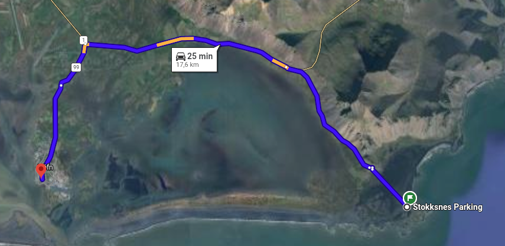
* _**Stokksnes mirror beach**_

#### From Stokksnes to Petra’s Stone Collection (02:27)
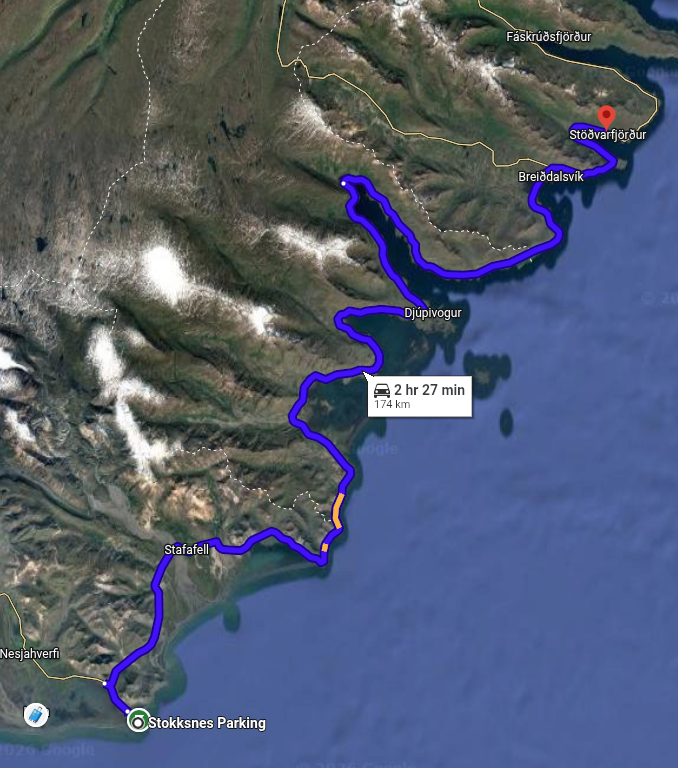
* _**Petra’s Stone Collection (60 zl)**_

#### Petra’s Stone Collection to Hengifoss (01:31)
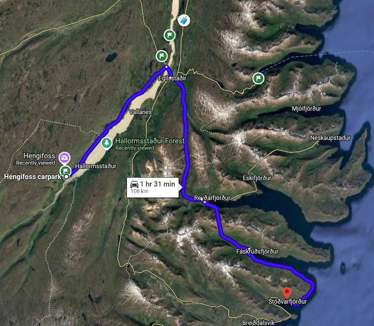
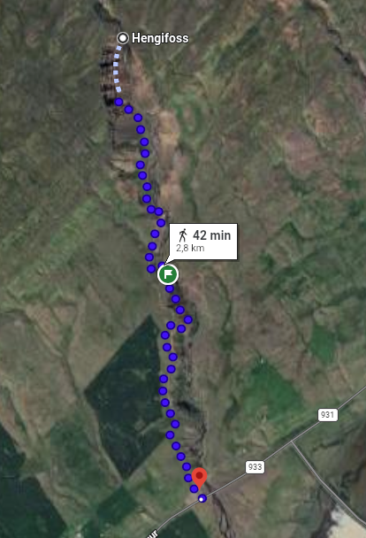
* _**Litlanesfoss**_
* _**Hengifoss (1:30 hiking)**_

#### Hengifoss to Borgarfjarðarhöfn (01:31)
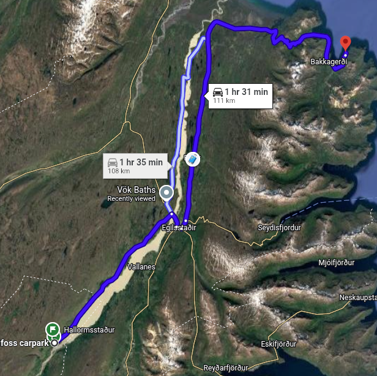
* _**Borgarfjörður**_

#### From Borgarfjarðarhöfn to Eiðar (00:52)
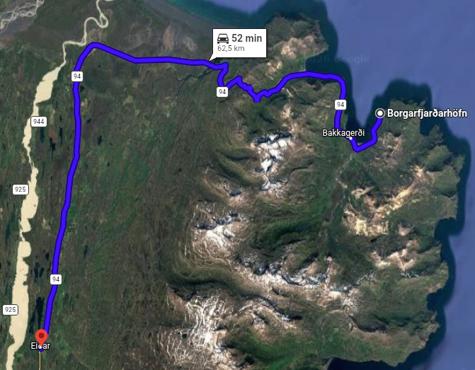
* _**Sleepover**_

## 01.09.2026 | Myvatn Area

#### From Eiðar to Dettifoss (02:15)

* _**Dettifoss**_

#### From Dettifoss to Krafla (00:43)

* _**Krafla**_

#### From Krafla to Leirhnjukur (00:02)

* _**Leirhnjukur**_

#### From Leirhnjukur to Námafjall (00:09)

* _**Hverir**_

#### From Hverir to Grjótagjá (00:07)

* _**Grjótagjá**_

#### From Grjótagjá to Hverfjall (00:11)

* _**Hverfjall**_

#### From Grjótagjá to Dimmuborgir (00:08)

* _**Kirkjuhringur trail**_
* _**Lava field of Dimmuborgir**_
* _**Kirkja – lava cave**_

#### From Dimmuborgir to Skútustaðir (00:12)

* _**Lake Myvatn (the mosquito lake)**_

#### From Lake Myvatn to Laxhús (00:43)

* _**Sleepover**_

## 02.09.2026 | Whales, Godafoss & Akureyri

#### From Laxhús to Húsavík (00:09)
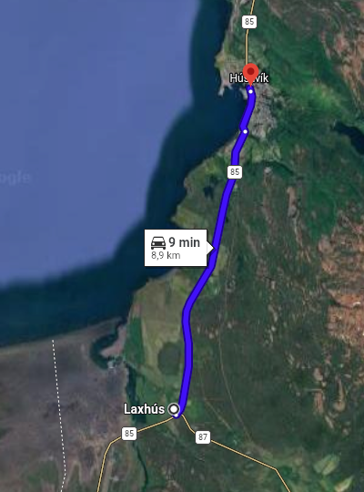
* _**Húsavík: Whale Watching Tour (350 zl)**_

#### From Húsavík to Godafoss (00:37)
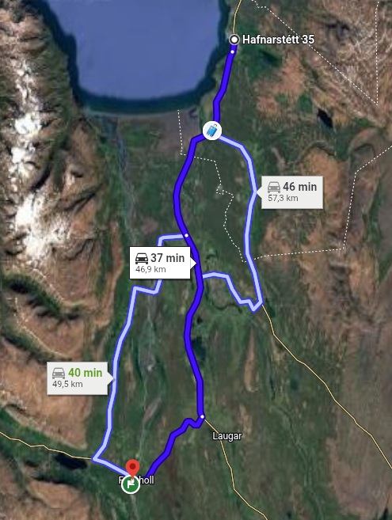
* _**Godafoss**_

#### From Godafoss to Svalbarðseyri (00:34)
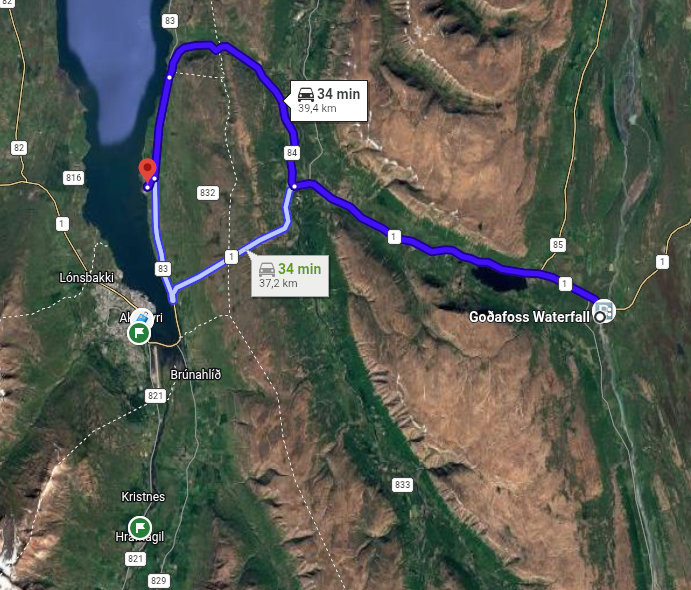
* _**Quirky art gallery**_
* _**Orange lighthouse**_

#### From Svalbarðseyri to Jólahúsið (Christmas House) (00:21)
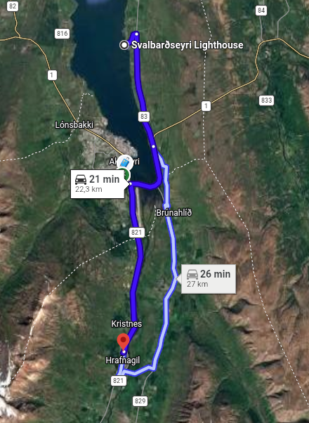
* _**Jólahúsið (Christmas House)**_

#### From Christmas House to Forest Lagoon (00:11)
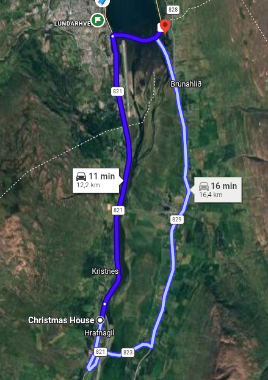
* _**Forest Lagoon (300 zl)**_

#### From Forest Lagoon to Akureyri (00:04)
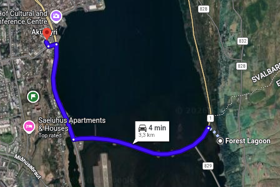
* _**Sleepover**_

## 03.09.2026 | Tröllaskagi Peninsula

#### From Akureyri to Siglufjörður (01:17)
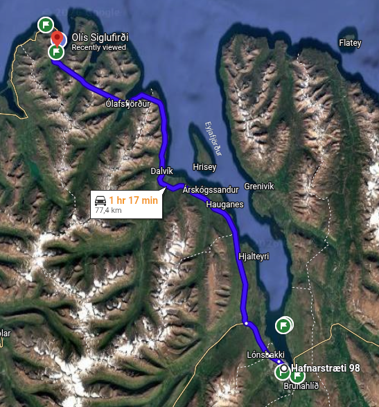
* _**a nice little town with an extremely picturesque harbor area**_

#### From Siglufjörður to Sauðanesviti (00:08)
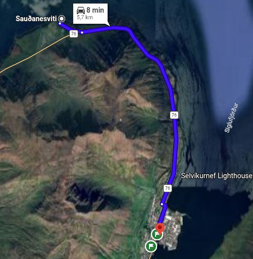
* _**Trollaskagi Lighthouse**_

#### From Sauðanesviti to Hofsos (00:51)
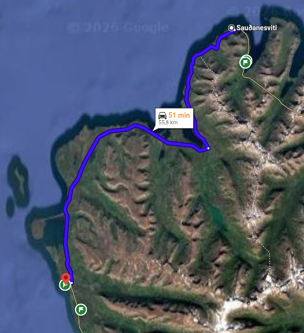
* _**Hofsos swimming pool (50 zl)**_

#### From Hofsos to Grafarkirkja (00:04)
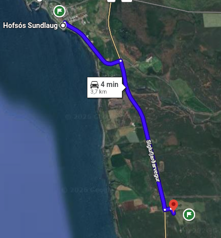
* _**Grafarkirkja**_

#### From Grafarkirkja to Glaumbær Turf Farm & Museum (00:37)
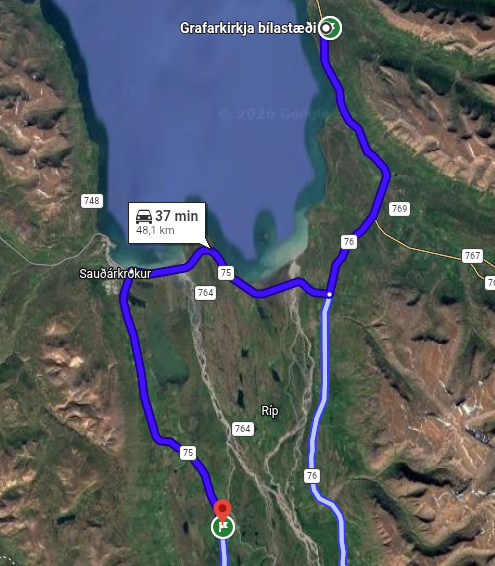
* _**Glaumbær Turf Farm & Museum (65 zl)**_

#### From Glaumbær Turf Farm & Museum to Reykjafoss (00:16)
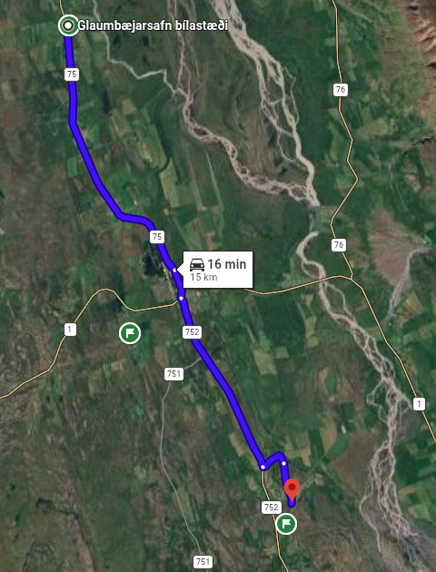
* _**Reykjafoss**_

#### From Reykjafoss to Víðimýrarkirkja (00:10)
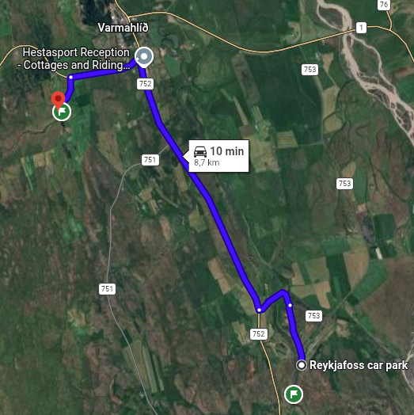
* _**Víðimýrarkirkja**_

#### From Víðimýrarkirkja to Húnavellir Guesthouse (00:40)
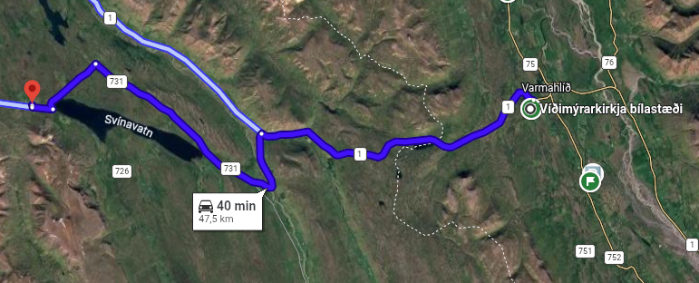
* _**Sleepover**_

## 04.09.2026 | North Coast to Snaefellsnes

#### From Húnavellir Guesthouse to Þingeyraklausturskirkja Church (00:19)

* _**Þingeyraklausturskirkja Church**_

#### From Þingeyraklausturskirkja Church to Borgarvirki (00:32)

* _**Borgarvirki**_

#### From Borgarvirki to Hvitserkur (00:22)

* _**Hvitserkur**_

#### From Hvitserkur to Kolugljúfur Canyon (00:39)

* _**Kolugljúfur Canyon**_

#### From Kolugljúfur Canyon to Eiriksstadir – Viking Longhouse (01:21)

* _**Eiriksstadir – Viking Longhouse (90 zl)**_

#### From Viking Longhouse to Súgandisey Island Lighthouse (01:27)

* _**Súgandisey Island Lighthouse**_

#### From Súgandisey Island Lighthouse to Berserkjahraun lava field (00:21)

* _**Berserkjahraun lava field**_

#### From Berserkjahraun lava field to Kirkjufell Guesthouse (00:16)

* _**Sleepover**_
